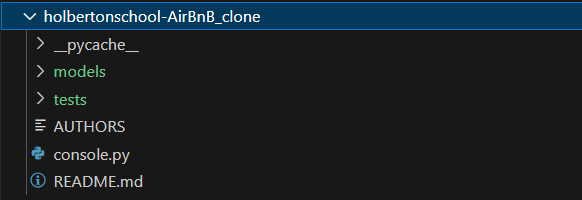

# Holberton-AirBnB_clone


## Description
The Airbnb_clone consists of 3 major components. One of them is the command-line interface (CLI) application ***-console.py-*** designed to manage Airbnb-like property listings and user interactions. This console provides functionalities to create, retrieve, update, and delete data related to various instances of the Airbnb ecosystem, including users, properties, reviews, places, and more.

At the core of the application lies the **FileStorage** engine, implemented through the ***-file_storage.py-*** module. This engine is managing data storage and retrieval operations. It handles the serialization and deserialization of instances to and from a JSON file, serving as a local database for the application. It offers functionalities such as retrieving all stored instances, saving the current state of data to the JSON file, and reloading data from the file into memory.The reload functionality is enabled by the file from: ***-models/__init__.py-***

The third major component is the **BaseModel** super class, implemented through the ***-base_model.py-*** module. BaseModel allows to create multiple instances based on it self or from the other subclasses. It assigns a random generated id with UUID, the date in wich the instances was created and the date when it was last updated. Any instance created from BaseModel will be saved to the storage

### Table of Contents

- [Description](#description)
- [Files](#files)
- [Commands](#commands)
- [Install](#install)
- [Use](#use)
- [Examples](#examples)
- [Resources](#resources)
- [Credits](#credits)
  

## Files

| Files                  | Content                                           |
|------------------------|---------------------------------------------------------|
| [*README.md*](README.md) | Contains the description of the project and usage instructions. |
| [*console.py*](console.py)| Command interpreter using the cmd module.|                      |
| [*file_storage.py*](models/engine/file_storage.py) | Serializes instances to a JSON file and deserializes JSON file back to instances.|  
| [*models/__init__.py*](models/__init__.py) | Init for reloading from JSON file to storage|
| [*base_model.py*](models/base_model.py) | Super class serving as the base for all subclasses.   |
| [*user.py*](models/user.py) | Sub class representing User instance. |
| [*city.py*](models/city.py) | Sub class representing City instance. |
| [*place.py*](models/place.py) | Sub class representing Place instance.|
| [*review.py*](models/review.py) | Sub class representing Review instance.|
| [*state.py*](models/state.py) | Sub class representing State instance.|
| [*amenity.py*](models/amenity.py) | Sub class representing User instance. |


## Commands

| Commands   | Description                                                                                           |
|-----------|-------------------------------------------------------------------------------------------------------|
| `create`| Creates a new instance of the specified class, also prints id of the instance                         |
| `show`  | Print string representation of an instance based on the class and id                                  |
| `all`   | Prints list of string representation of all instances or just from specified class                     |
| `destroy`| Delete an instance based on the class name and id                                                      |
| `update`| Update values for an attribute of a specified instance from a class                                    |
| `count()` | Prints total number of instances of a class or all instances                                           |

## Install

This project was built in Python 3.12.1.

To install:

1. Open a terminal.
2. Navigate to the directory where you want to clone the repository.
3. Run the following command: `git clone git@github.com:Antoniofdjs/holbertonschool-AirBnB_clone.git`

   


## Use 
To start using the console...


```
exampleeee hereee
```
In the console running

```
usagee examplee
```
To run .count() command

```
(hbnb) .count()
```
Basic usage example


## Examples

```
(hbnb) all
[]     
(hbnb) create User
be9d66bf-a5a3-4c5d-8de5-6afb86bad424
(hbnb) all
["[User] (be9d66bf-a5a3-4c5d-8de5-6afb86bad424) {'id': 'be9d66bf-a5a3-4c5d-8de5-6afb86bad424',
'created_at': datetime.datetime(2024, 2, 25, 19, 42, 26, 233003),
'updated_at': datetime.datetime(2024, 2, 25, 19, 42, 26, 233003)}"]
(hbnb) destroy User be9d66bf-a5a3-4c5d-8de5-6afb86bad424
(hbnb) all                                               
[]     
(hbnb) 
```

## Resources

 - *[CMD Module](https://docs.python.org/3/library/cmd.html)*
- *[UUID Module](https://docs.python.org/3/library/uuid.html)*
- *[Datetime Module](https://docs.python.org/3/library/datetime.html)*
- *[args/kwargs](https://yasoob.me/2013/08/04/args-and-kwargs-in-python-explained/)*
- *[Python Test Sheets](https://www.pythonsheets.com/notes/python-tests.html)*


## Credits

 - *[Antonio De Jesus Santiago](https://github.com/Antoniofdjs)*
 - *[Juan Gabriel Collazo](https://github.com/juancollazo5)*
